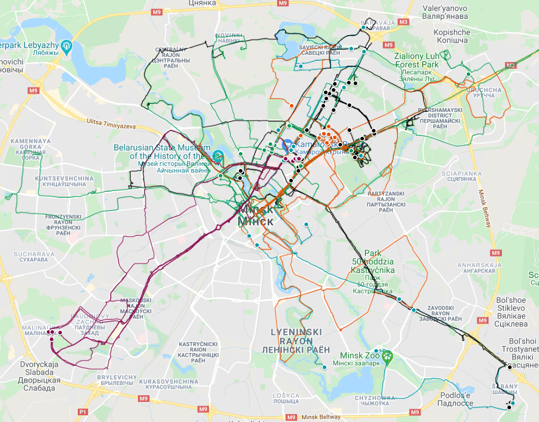

# RuntasticExportProcessor

Tool to convert GPS data from *Adidas Running* app (ex-Runtastic) to convenient format ready to export into *Google My Maps*

## Where to get the data
1. Log in to https://www.runtastic.com/
2. Top-right menu (near the photo) -> Settings (Account and Data)
3. Export data button (can take more than 1 day to wait)

## How to run the app
App requires the path to the folder with exported files. It is the folder that contains Sport-sessions folder, data_information.pdf file, etc.

### How to run the code
- Run the app using dotnet compiler: `dotnet run "C:\Users\<Username>\Downloads\runtastic export folder"`
- Get an executable file: `dotnet publish -r win-x64 -c Release /p:PublishSingleFile=true /p:PublishTrimmed=true`

### How to pass the path to folder
- Pass it as console app argument. If you work in Visual studio, check the launchSettings.json file - I used it to pass the path to the app in Debug mode.
- Start console app and copy-paste path to the console window.
- Put executable file into necessary folder, start the app and just press enter when console app will prompt for the path.

## How to export data to Google My Maps
1. Log in to https://www.google.com/maps/d/
2. Create new map and add new layer.
3. Click 'Import' link.
4. Drag and drop your gpx file.
5. (optional) Click on 'Individual styles' and select 'Uniform' style.
6. (optional) Click on icon right from 'All items' and select smallest 'Point' icon.

### Result example

